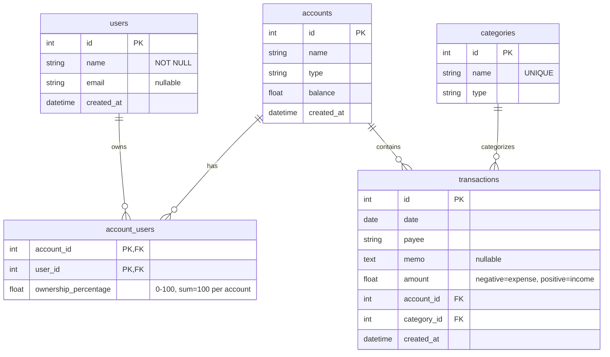

# Data Model

## Tables

### `users`
Stores application users. Each user can own one or more accounts (via `account_users`).

| Column | Type | Notes |
|--------|------|-------|
| `id` | Integer | Primary key, autoincrement |
| `name` | String(100) | Required |
| `email` | String(200) | Optional |
| `created_at` | DateTime | Default: current UTC time |

### `account_users`
Junction table linking users to accounts with ownership percentages. Enables joint accounts.

| Column | Type | Notes |
|--------|------|-------|
| `account_id` | Integer | Foreign key → `accounts.id`, part of composite PK |
| `user_id` | Integer | Foreign key → `users.id`, part of composite PK |
| `ownership_percentage` | Float | Percentage of ownership (0–100). Sum must equal 100 per account |

### `accounts`
Financial accounts (checking, savings, credit card, etc.).

| Column | Type | Notes |
|--------|------|-------|
| `id` | Integer | Primary key, autoincrement |
| `name` | String(100) | Required |
| `type` | String(50) | Required |
| `balance` | Float | Default: 0.0 |
| `created_at` | DateTime | Default: current UTC time |

### `categories`
Transaction categories (income, expense, transfer).

| Column | Type | Notes |
|--------|------|-------|
| `id` | Integer | Primary key, autoincrement |
| `name` | String(100) | Required, unique |
| `type` | String(50) | Required |

### `transactions`
Individual financial transactions.

| Column | Type | Notes |
|--------|------|-------|
| `id` | Integer | Primary key, autoincrement |
| `date` | Date | Required |
| `payee` | String(200) | Required |
| `memo` | Text | Optional |
| `amount` | Float | Negative = expense, positive = income |
| `account_id` | Integer | Foreign key → `accounts.id` |
| `category_id` | Integer | Foreign key → `categories.id` |
| `created_at` | DateTime | Default: current UTC time |

## Key Relationships

- **Users ↔ Accounts**: Many-to-many via `account_users`. Each user can own multiple accounts; each account can have multiple owners (joint account).
- **Accounts ↔ Transactions**: One-to-many. An account can have many transactions.
- **Categories ↔ Transactions**: One-to-many. A category can classify many transactions.
- **Ownership validation**: The backend enforces that ownership percentages sum to exactly 100% per account (within 0.01 tolerance).
- **User filtering**: API endpoints `/api/transactions`, `/api/dashboard`, `/api/accounts` accept an optional `?user_id=X` query parameter to filter by account ownership (where `ownership_percentage > 0`).
