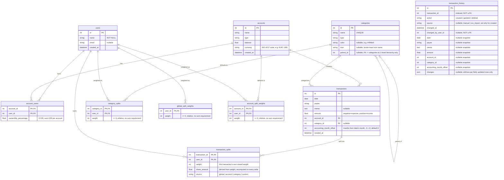

# Data Model

## Tables

### `users`
Stores application users. Each user can own one or more accounts (via `account_users`).

| Column | Type | Notes |
|--------|------|-------|
| `id` | Integer | Primary key, autoincrement |
| `name` | String(100) | Required |
| `email` | String(200) | Optional |
| `created_at` | DateTime | Default: current UTC time |

### `account_users`
Junction table linking users to accounts with ownership percentages. Enables joint accounts.

| Column | Type | Notes |
|--------|------|-------|
| `account_id` | Integer | Foreign key → `accounts.id`, part of composite PK |
| `user_id` | Integer | Foreign key → `users.id`, part of composite PK |
| `ownership_percentage` | Float | Percentage of ownership (0–100). Sum must equal 100 per account |

### `accounts`
Financial accounts (checking, savings, credit card, etc.).

| Column | Type | Notes |
|--------|------|-------|
| `id` | Integer | Primary key, autoincrement |
| `name` | String(100) | Required |
| `type` | String(50) | Required |
| `balance` | Float | Default: 0.0 |
| `currency` | String(3) | ISO 4217 code, e.g. `EUR`, `USD`. Default: `EUR` |
| `created_at` | DateTime | Default: current UTC time |

### `categories`
Transaction categories (income, expense, transfer).

| Column | Type | Notes |
|--------|------|-------|
| `id` | Integer | Primary key, autoincrement |
| `name` | String(100) | Required, unique |
| `type` | String(50) | Required |
| `color` | String(7) | Optional, hex color (e.g. `#4f46e5`) shown as the category's badge color |
| `icon` | String(50) | Optional, `lucide-react` icon name shown as the category's badge icon |
| `parent_id` | Integer | Optional, self-referential foreign key → `categories.id`. A strict 2-level hierarchy: a category with `parent_id` set is a subcategory, and its parent must itself have no parent. A subcategory's `type` must match its parent's |

### `transactions`
Individual financial transactions.

| Column | Type | Notes |
|--------|------|-------|
| `id` | Integer | Primary key, autoincrement |
| `date` | Date | Required |
| `payee` | String(200) | Required |
| `memo` | Text | Optional |
| `amount` | Float | Negative = expense, positive = income. Denominated in the parent account's `currency` — a transaction has no currency of its own |
| `account_id` | Integer | Foreign key → `accounts.id` |
| `category_id` | Integer | Foreign key → `categories.id`, nullable — an uncategorized transaction is shown as "Uncategorized" |
| `accounting_month_offset` | Integer | Months relative to `date`'s month this transaction should be accounted in. Range -3..+3, default 0 (same month as `date`) |
| `created_at` | DateTime | Default: current UTC time |

### `category_splits`
The **highest-priority** weight tier: an optional default split-weight for a category — e.g. "Mortgage" always prefills 1:1 regardless of the account or global default. Purely a prefill source for new/edited transactions' own weights; never live-resolved.

| Column | Type | Notes |
|--------|------|-------|
| `category_id` | Integer | Foreign key → `categories.id`, part of composite PK |
| `user_id` | Integer | Foreign key → `users.id`, part of composite PK |
| `weight` | Integer | Relative integer weight, `>= 0`. No sum requirement — it's a ratio, not a percentage |

### `global_split_weights`
The **lowest-priority** weight tier: a relative integer weight per user (e.g. proportional to income), used to prefill a transaction's weights when neither its account nor its category has a weight configured.

| Column | Type | Notes |
|--------|------|-------|
| `user_id` | Integer | Primary key, foreign key → `users.id` |
| `weight` | Integer | Relative weight (not a percentage), `>= 0` — normalized against the sum of all weights when prefilling |

### `account_split_weights`
The **middle-priority** weight tier: a relative integer weight per user, scoped to one account. Entirely independent of `account_users.ownership_percentage` — ownership and split weight are two separate, coexisting concepts (ownership drives visibility and the "paid" side of balances; this table only feeds split-weight prefill).

| Column | Type | Notes |
|--------|------|-------|
| `account_id` | Integer | Foreign key → `accounts.id`, part of composite PK |
| `user_id` | Integer | Foreign key → `users.id`, part of composite PK |
| `weight` | Integer | Relative weight, `>= 0`. No sum requirement |

### `transaction_splits`
Every transaction stores its **own** integer `weight` per involved user — freely typed by the client, or bulk-filled from a tier via a quick-access button (category > account > global priority, prefill-only). `share_amount` is always *derived* from `weight` against the transaction's current `amount`, recomputed and persisted on every create/update — it is never itself client-editable, and it is never re-resolved from the tiers' *current* configuration once the transaction exists (only its own stored `weight` matters going forward).

| Column | Type | Notes |
|--------|------|-------|
| `transaction_id` | Integer | Foreign key → `transactions.id`, part of composite PK |
| `user_id` | Integer | Foreign key → `users.id`, part of composite PK |
| `weight` | Integer | This transaction's own stored weight for this user |
| `share_amount` | Float | What this user is liable for — derived from `weight`, recomputed on every write |
| `source` | String(20) | Which tier/button last produced this weight set: `global`, `account`, `category`, or `custom` (hand-typed) — display-only, never used for split logic |

### `transaction_history`
Audit trail: one row per transaction create/update/delete, with a snapshot of the transaction's fields at that moment. Deliberately **not** linked by foreign key to `transactions` or `users` — see Key Relationships below.

| Column | Type | Notes |
|--------|------|-------|
| `id` | Integer | Primary key, autoincrement |
| `transaction_id` | Integer | Indexed, but not a foreign key |
| `action` | String(20) | `created`, `updated`, or `deleted` |
| `source` | String(20) | Optional; `manual` or `csv_import`, set only on `created` rows |
| `changed_at` | DateTime | Default: current UTC time |
| `changed_by_user_id` | Integer | Optional, not a foreign key |
| `date` / `payee` / `memo` / `amount` / `account_id` / `category_id` / `accounting_month_offset` | (matches `transactions`) | Nullable snapshot of the transaction's fields at the time of the change |
| `changes` | JSON | Optional; for `updated` rows only, `{field: {"old": ..., "new": ...}}` |

## Key Relationships

- **Users ↔ Accounts**: Many-to-many via `account_users`. Each user can own multiple accounts; each account can have multiple owners (joint account).
- **Accounts ↔ Transactions**: One-to-many. An account can have many transactions.
- **Categories ↔ Transactions**: One-to-many, and optional — `category_id` is nullable, so a transaction can have no category ("Uncategorized"). A transaction may be assigned either a top-level category or a subcategory — there's no requirement to always pick the most specific one.
- **Categories ↔ Categories (subcategories)**: Self-referential, one-to-many via `parent_id`, capped at exactly 2 levels — a category with `parent_id` set (a subcategory) cannot itself have children, enforced in `backend/main.py` rather than at the DB level. A subcategory's `type` must equal its parent's. Deleting a category with existing subcategories is blocked (409), the same pattern used for a category with existing transactions. Subcategories do **not** inherit their parent's `category_splits` weight tier or roll up into it in `charts.py` — each category's split-weight prefill and chart grouping is independent of the hierarchy.
- **Ownership validation**: The backend enforces that ownership percentages sum to exactly 100% per account (within 0.01 tolerance).
- **User filtering**: API endpoints `/api/transactions`, `/api/dashboard`, `/api/accounts` accept an optional `?user_id=X` query parameter to filter by account ownership (where `ownership_percentage > 0`).
- **Accounting month**: each transaction stores `accounting_month_offset` (months relative to its own `date`, -3..+3, default 0), letting a transaction be attributed to a different reporting month than the one it was dated in — e.g. a paycheck dated the last day of a month that should count toward the next. The API also returns a derived, not stored, `accounting_month` ("YYYY-MM") computed from `date + accounting_month_offset` (`backend/accounting_month.py`), for reports/dashboards to group by later.
- **Split weights are prefill-only, never live-resolved** (`backend/split_engine.py`): every transaction stores its own integer `weight` per involved user in `transaction_splits`, freely editable or bulk-filled via a quick-access button from one of three tiers, in ascending priority: `global_split_weights` (lowest) → `account_split_weights` (middle) → `category_splits` (highest, wins when configured). `resolve_default_weights()` is used *only* to suggest a default when composing/editing a transaction's own weights (interactively client-side, or server-side for CSV import) — it is never consulted again once a transaction exists, so changing a tier's weights later never retroactively changes an existing transaction's split. If nothing is configured at any tier and the client supplies no weights of its own, no `transaction_splits` rows are created (the feature stays opt-in). There is no single-owner-account gating of any kind — a tier's weights apply regardless of how many owners an account has.
- **Ownership and split weight are independent, coexisting concepts**: `account_users.ownership_percentage` is unrelated to `account_split_weights` — the former drives account/dashboard visibility filtering, the sum-to-100 ownership validation, and the "paid" side of balance math (below); the latter is purely one of the three split-weight prefill tiers. A single-owner account can have a configured `account_split_weights` row just like a joint one.
- **Splits are frozen, ownership is live**: `transaction_splits.share_amount` (what a user is *liable* for) is recomputed from the transaction's own stored `weight` and persisted on every write that touches either the weight or the amount — but never re-derived from the *tiers'* current configuration. What a user *paid* is instead derived live from the account's *current* `account_users.ownership_percentage` — so historical liability stays stable even if account ownership changes later, but the settlement report always reflects today's ownership. The household balance report (`GET /api/balances`, also embedded in `GET /api/dashboard`) is `sum(paid) − sum(share_amount)` per user — positive means the household owes them, negative means they owe the household.
- **Multi-currency accounts, no conversion**: each account has its own `currency`; transactions and splits inherit it from their account rather than storing it themselves. Amounts are never converted or summed across currencies — `compute_balances()` (`backend/split_engine.py`) partitions by `(user_id, currency)`, so `GET /api/balances` returns one net position per user *per currency*, and a household with mixed-currency accounts gets a separate settlement line for each currency instead of a single blended total.
- **Audit trail is intentionally unlinked**: `transaction_history.transaction_id` and `changed_by_user_id` are plain (indexed) integers, not foreign keys. SQLite runs with `PRAGMA foreign_keys=ON`, so a real FK to `transactions.id` would either block a hard delete or be cascaded away with it — defeating the point of an audit log that must outlive the row it describes. History rows are written by `backend/audit.py` on every transaction create/update/delete and read via `GET /api/transactions/{id}/history`.
