# Data Model

```mermaid
erDiagram
    users ||--o{ account_users : "owns"
    accounts ||--o{ account_users : "has"
    accounts ||--o{ transactions : contains
    categories |o--o{ transactions : categorizes
    categories ||--o{ category_splits : "defaults to"
    categories |o--o{ categories : "parent of"
    users ||--o{ category_splits : "weighted as"
    users ||--o{ global_split_weights : "weighted as"
    accounts ||--o{ account_split_weights : "defaults to"
    users ||--o{ account_split_weights : "weighted as"
    transactions ||--o{ transaction_splits : "split into"
    users ||--o{ transaction_splits : "owes"

    transaction_history {
        int id PK
        int transaction_id "indexed, NOT a FK"
        string action "created | updated | deleted"
        string source "nullable; manual | csv_import | divide, set only for created (divide can also appear on updated)"
        datetime changed_at
        int changed_by_user_id "nullable, NOT a FK"
        date date "nullable snapshot"
        string payee "nullable snapshot"
        text memo "nullable snapshot"
        float amount "nullable snapshot"
        int account_id "nullable snapshot"
        int category_id "nullable snapshot"
        int accounting_month_offset "nullable snapshot"
        json changes "nullable; old/new per field, updated rows only"
    }

    users {
        int id PK
        string name "NOT NULL"
        string email "nullable"
        datetime created_at
    }

    account_users {
        int account_id PK,FK
        int user_id PK,FK
        float ownership_percentage "0-100, sum=100 per account"
    }

    accounts {
        int id PK
        string name
        string type
        float balance_offset "internal; displayed balance = this + sum(transactions)"
        string currency "ISO 4217 code, e.g. EUR, USD"
        datetime created_at
        boolean archived "default false; hides account from dashboard/new-tx picker, history unaffected"
    }

    categories {
        int id PK
        string name "UNIQUE"
        string type
        string color "nullable, e.g. #4f46e5"
        string icon "nullable, lucide-react icon name"
        int parent_id "nullable, FK -> categories.id; 2-level hierarchy only"
    }

    category_splits {
        int category_id PK,FK
        int user_id PK,FK
        int weight ">= 0, relative, no sum requirement"
    }

    global_split_weights {
        int user_id PK,FK
        int weight ">= 0, relative, no sum requirement"
    }

    account_split_weights {
        int account_id PK,FK
        int user_id PK,FK
        int weight ">= 0, relative, no sum requirement"
    }

    transactions {
        int id PK
        date date
        string payee
        text memo "nullable"
        float amount "negative=expense, positive=income"
        int account_id FK
        int category_id FK "nullable"
        int accounting_month_offset "months from date's month, -3..+3, default 0"
        boolean reconciled "manually set, default false"
        datetime created_at
        int divide_group_id "nullable, NOT a FK; anchor transaction's own id, shared by every part of a divide"
    }

    transaction_splits {
        int transaction_id PK,FK
        int user_id PK,FK
        int weight "this transaction's own stored weight"
        float share_amount "derived from weight, recomputed on every write"
        string source "global | account | category | custom"
    }
```

## Tables

### `users`
Stores application users. Each user can own one or more accounts (via `account_users`).

| Column | Type | Notes |
|--------|------|-------|
| `id` | Integer | Primary key, autoincrement |
| `name` | String(100) | Required |
| `email` | String(200) | Optional |
| `created_at` | DateTime | Default: current UTC time |

### `account_users`
Junction table linking users to accounts with ownership percentages. Enables joint accounts.

| Column | Type | Notes |
|--------|------|-------|
| `account_id` | Integer | Foreign key → `accounts.id`, part of composite PK |
| `user_id` | Integer | Foreign key → `users.id`, part of composite PK |
| `ownership_percentage` | Float | Percentage of ownership (0–100). Sum must equal 100 per account |

### `accounts`
Financial accounts (checking, savings, credit card, etc.).

| Column | Type | Notes |
|--------|------|-------|
| `id` | Integer | Primary key, autoincrement |
| `name` | String(100) | Required |
| `type` | String(50) | Required |
| `balance_offset` | Float | Default: 0.0. **Internal** — never exposed by the API. The balance a client sees is `balance_offset + sum(that account's transaction amounts)`, so it tracks activity instead of staying frozen. When a user enters a balance (on create, or by editing the Balance field), the backend stores `entered balance − current transaction total` here, so the account shows exactly what they typed until its next transaction |
| `currency` | String(3) | ISO 4217 code, e.g. `EUR`, `USD`. Default: `EUR` |
| `created_at` | DateTime | Default: current UTC time |
| `archived` | Boolean | Default: `false`. Hides the account from the dashboard and the new-transaction account picker; doesn't affect existing transactions, balances, or charts |

### `categories`
Transaction categories (income, expense, transfer).

| Column | Type | Notes |
|--------|------|-------|
| `id` | Integer | Primary key, autoincrement |
| `name` | String(100) | Required, unique |
| `type` | String(50) | Required |
| `color` | String(7) | Optional, hex color (e.g. `#4f46e5`) shown as the category's badge color |
| `icon` | String(50) | Optional, `lucide-react` icon name shown as the category's badge icon |
| `parent_id` | Integer | Optional, self-referential foreign key → `categories.id`. A strict 2-level hierarchy: a category with `parent_id` set is a subcategory, and its parent must itself have no parent. A subcategory's `type` must match its parent's |

### `transactions`
Individual financial transactions.

| Column | Type | Notes |
|--------|------|-------|
| `id` | Integer | Primary key, autoincrement |
| `date` | Date | Required |
| `payee` | String(200) | Required |
| `memo` | Text | Optional |
| `amount` | Float | Negative = expense, positive = income. Denominated in the parent account's `currency` — a transaction has no currency of its own |
| `account_id` | Integer | Foreign key → `accounts.id` |
| `category_id` | Integer | Foreign key → `categories.id`, nullable — an uncategorized transaction is shown as "Uncategorized" |
| `accounting_month_offset` | Integer | Months relative to `date`'s month this transaction should be accounted in. Range -3..+3, default 0 (same month as `date`) |
| `reconciled` | Boolean | Default: `false`. Manually set by the user once they've reviewed/validated the transaction — never inferred. Always `false` on creation and on CSV import |
| `created_at` | DateTime | Default: current UTC time |
| `divide_group_id` | Integer | Nullable, indexed, **not** a foreign key (same reasoning as `transaction_history` below — a real FK would block deleting one part of a divide while siblings still reference it). Set by "Dividing a transaction" (see below) to the group's anchor transaction's own `id`, on every part including the anchor itself (`divide_group_id == id` for the anchor). `NULL` for a transaction that's never been divided |

### `category_splits`
The **highest-priority** weight tier: an optional default split-weight for a category — e.g. "Mortgage" always prefills 1:1 regardless of the account or global default. Purely a prefill source for new/edited transactions' own weights; never live-resolved.

| Column | Type | Notes |
|--------|------|-------|
| `category_id` | Integer | Foreign key → `categories.id`, part of composite PK |
| `user_id` | Integer | Foreign key → `users.id`, part of composite PK |
| `weight` | Integer | Relative integer weight, `>= 0`. No sum requirement — it's a ratio, not a percentage |

### `global_split_weights`
The **lowest-priority** weight tier: a relative integer weight per user (e.g. proportional to income), used to prefill a transaction's weights when neither its account nor its category has a weight configured. Unlike `category_splits`/`account_split_weights`, this tier is a **mandatory floor**: every user gets a `weight=1` row here automatically on creation, and it can never be saved empty or entirely zeroed out — see "Splits are mandatory" above.

| Column | Type | Notes |
|--------|------|-------|
| `user_id` | Integer | Primary key, foreign key → `users.id` |
| `weight` | Integer | Relative weight (not a percentage), `>= 0` — normalized against the sum of all weights when prefilling |

### `account_split_weights`
The **middle-priority** weight tier: a relative integer weight per user, scoped to one account. Entirely independent of `account_users.ownership_percentage` — ownership and split weight are two separate, coexisting concepts (ownership drives visibility and the "paid" side of balances; this table only feeds split-weight prefill).

| Column | Type | Notes |
|--------|------|-------|
| `account_id` | Integer | Foreign key → `accounts.id`, part of composite PK |
| `user_id` | Integer | Foreign key → `users.id`, part of composite PK |
| `weight` | Integer | Relative weight, `>= 0`. No sum requirement |

### `transaction_splits`
Every transaction stores its **own** integer `weight` per involved user — freely typed by the client, or bulk-filled from a tier via a quick-access button (category > account > global priority, prefill-only). `share_amount` is always *derived* from `weight` against the transaction's current `amount`, recomputed and persisted on every create/update — it is never itself client-editable, and it is never re-resolved from the tiers' *current* configuration once the transaction exists (only its own stored `weight` matters going forward).

| Column | Type | Notes |
|--------|------|-------|
| `transaction_id` | Integer | Foreign key → `transactions.id`, part of composite PK |
| `user_id` | Integer | Foreign key → `users.id`, part of composite PK |
| `weight` | Integer | This transaction's own stored weight for this user |
| `share_amount` | Float | What this user is liable for — derived from `weight`, recomputed on every write |
| `source` | String(20) | Which tier/button last produced this weight set: `global`, `account`, `category`, or `custom` (hand-typed) — display-only, never used for split logic |

### `transaction_history`
Audit trail: one row per transaction create/update/delete, with a snapshot of the transaction's fields at that moment. Deliberately **not** linked by foreign key to `transactions` or `users` — see Key Relationships below.

| Column | Type | Notes |
|--------|------|-------|
| `id` | Integer | Primary key, autoincrement |
| `transaction_id` | Integer | Indexed, but not a foreign key |
| `action` | String(20) | `created`, `updated`, or `deleted` |
| `source` | String(20) | Optional; `manual`, `csv_import`, or `divide` (set only on `created` rows), or `divide` again on the `updated` row recorded when a transaction becomes a divide's anchor part |
| `changed_at` | DateTime | Default: current UTC time |
| `changed_by_user_id` | Integer | Optional, not a foreign key |
| `date` / `payee` / `memo` / `amount` / `account_id` / `category_id` / `accounting_month_offset` | (matches `transactions`) | Nullable snapshot of the transaction's fields at the time of the change |
| `changes` | JSON | Optional; on `updated` rows, `{field: {"old": ..., "new": ...}}` for changed `transactions` columns; on `created` rows, only ever a `splits` key (below) — never the scalar transaction fields, since there's nothing to diff a brand-new row against |
| `changes.splits` | JSON (nested key) | Present only when the transaction's `transaction_splits` weights changed (`updated`) or were set on creation (`created`): `{"old": [...] \| null, "new": [...]}`, each list a snapshot of `{"user_id", "weight", "source"}` per involved user at that moment. `old` is `null` on a `created` row (no prior state); `[]` means "no splits" on either side. Never populated on `deleted` rows. |

### `aggregate_cache`
Generic store for precomputed aggregate results (dashboard/balances, charts), backing the caching service in `backend/cache_service.py` — not a domain entity, and not part of `backup`'s export/import (backup restore wipes/resets it instead, see Key Relationships below).

| Column | Type | Notes |
|--------|------|-------|
| `cache_key` | String | Primary key — `"<namespace>:k1=v1:k2=v2..."`, e.g. `balances:user_id=3` |
| `namespace` | String | Indexed; groups related entries for bulk invalidation, e.g. `balances`, `charts` |
| `payload` | Text | `json.dumps()` of the cached result |
| `computed_at` | DateTime | When this entry was (re)computed |

### `onedrive_backup_settings`
Single global row (`id=1`) driving the OneDrive automatic backup connection (`backend/onedrive.py`) — one connection for the whole household database, not per-user, and not part of the account/transaction ER diagram above. Not part of `backup`'s export/import archive either: it's app configuration, not domain data. Token columns are Fernet-encrypted at rest and never returned by the API.

| Column | Type | Notes |
|--------|------|-------|
| `id` | Integer | Primary key; always `1` |
| `connected` | Boolean | Default: `false` |
| `account_email` | String | Nullable; the connected Microsoft account's email, for display only |
| `folder_path` | String | Nullable; the OneDrive folder backups are uploaded to, created automatically if missing |
| `frequency` | String(20) | `daily`, `weekly`, or `monthly`. Default: `daily` |
| `retention_count` | Integer | Default: 30. How many backup files to keep in the folder; older ones are deleted after each successful run |
| `access_token_encrypted` / `refresh_token_encrypted` | Text | Nullable; Fernet-encrypted OAuth tokens, keyed by `ONEDRIVE_TOKEN_ENCRYPTION_KEY` |
| `token_expires_at` | DateTime | Nullable; when the access token expires, so it's refreshed just-in-time |
| `last_backup_at` | DateTime | Nullable; also doubles as the "claim" timestamp written before a run starts, so an overlapping scheduler call sees it as no longer due |
| `last_backup_status` | String(20) | Nullable; `success` or `failed` |
| `last_backup_error` | Text | Nullable; set only when `last_backup_status` is `failed` |

## Key Relationships

- **Users ↔ Accounts**: Many-to-many via `account_users`. Each user can own multiple accounts; each account can have multiple owners (joint account).
- **Accounts ↔ Transactions**: One-to-many. An account can have many transactions.
- **Categories ↔ Transactions**: One-to-many, and optional — `category_id` is nullable, so a transaction can have no category ("Uncategorized"). A transaction may be assigned either a top-level category or a subcategory — there's no requirement to always pick the most specific one.
- **Categories ↔ Categories (subcategories)**: Self-referential, one-to-many via `parent_id`, capped at exactly 2 levels — a category with `parent_id` set (a subcategory) cannot itself have children, enforced in `backend/main.py` rather than at the DB level. A subcategory's `type` must equal its parent's. Deleting a category with existing subcategories is blocked (409), the same pattern used for a category with existing transactions. Subcategories do **not** inherit their parent's `category_splits` weight tier — each category's split-weight prefill is independent of the hierarchy. Chart grouping is a partial exception: `charts.py`'s month-by-category aggregation (backing the Charts page's "Spending per month" chart) rolls a subcategory's spend up into its parent for the top-level/overview view, and supports drilling into a parent's direct subcategories (plus a segment for transactions categorized directly on the parent itself, since both remain independently assignable) — the flat, ungrouped `by_category` aggregation used elsewhere still has no rollup.
- **Ownership validation**: The backend enforces that ownership percentages sum to exactly 100% per account (within 0.01 tolerance).
- **User filtering**: API endpoints `/api/transactions`, `/api/dashboard`, `/api/accounts` accept an optional `?user_id=X` query parameter to filter by account ownership (where `ownership_percentage > 0`).
- **Accounting month**: each transaction stores `accounting_month_offset` (months relative to its own `date`, -3..+3, default 0), letting a transaction be attributed to a different reporting month than the one it was dated in — e.g. a paycheck dated the last day of a month that should count toward the next. The API also returns a derived, not stored, `accounting_month` ("YYYY-MM") computed from `date + accounting_month_offset` (`backend/accounting_month.py`), for reports/dashboards to group by later.
- **Splits are mandatory, but prefill is never live-resolved** (`backend/split_engine.py`): every transaction always stores its own integer `weight` per involved user in `transaction_splits` — freely editable, or bulk-filled via a quick-access button from one of three tiers, in ascending priority: `global_split_weights` (lowest) → `account_split_weights` (middle) → `category_splits` (highest, wins when configured). If the client omits `split_weights` on create/update, the server resolves one itself via this same cascade (`resolve_default_weights()`), which is what makes the mandate possible: `global_split_weights` is a guaranteed non-empty floor (every user gets `weight=1` there by default the moment they're created — see below), so the cascade can never come back empty in normal use. An explicit empty `split_weights` list is rejected (422) rather than clearing a transaction's split, and an update that omits it but finds the transaction already has zero split rows (a pre-mandate data artefact) heals it via the same cascade rather than leaving it that way. `resolve_default_weights()` is never consulted again once a transaction exists otherwise, so changing a tier's weights later never retroactively changes an existing transaction's split. Deleting a user who's the sole participant in a transaction's split re-resolves it the same way (`routers/users.py::delete_user`), or 409s if the cascade comes up empty too. There is no single-owner-account gating of any kind — a tier's weights apply regardless of how many owners an account has.
- **The global tier is a mandatory floor, unlike account/category**: `POST /api/users` inserts a `GlobalSplitWeight(weight=1)` row for every new user, and `PUT /api/split-weights` rejects a save that would leave it empty or entirely zeroed out (`rules.validate_global_weights_present`) — the account and category tiers have no such floor and may legitimately be left unconfigured, since they're allowed to cascade down to global.
- **Ownership and split weight are independent, coexisting concepts**: `account_users.ownership_percentage` is unrelated to `account_split_weights` — the former drives account/dashboard visibility filtering, the sum-to-100 ownership validation, and the "paid" side of balance math (below); the latter is purely one of the three split-weight prefill tiers. A single-owner account can have a configured `account_split_weights` row just like a joint one.
- **Splits are frozen, ownership is live**: `transaction_splits.share_amount` (what a user is *liable* for) is recomputed from the transaction's own stored `weight` and persisted on every write that touches either the weight or the amount — but never re-derived from the *tiers'* current configuration. What a user *paid* is instead derived live from the account's *current* `account_users.ownership_percentage` — so historical liability stays stable even if account ownership changes later, but the settlement report always reflects today's ownership. The household balance report (`GET /api/balances`, also embedded in `GET /api/dashboard`) is `sum(paid) − sum(share_amount)` per user — positive means the household owes them, negative means they owe the household.
- **Multi-currency accounts, no conversion**: each account has its own `currency`; transactions and splits inherit it from their account rather than storing it themselves. Amounts are never converted or summed across currencies — `compute_balances()` (`backend/split_engine.py`) partitions by `(user_id, currency)`, so `GET /api/balances` returns one net position per user *per currency*, and a household with mixed-currency accounts gets a separate settlement line for each currency instead of a single blended total.
- **Aggregate caching**: `GET /api/dashboard`, `GET /api/balances`, and `GET /api/charts` cache their computed results in `aggregate_cache` (`backend/cache_service.py`), keyed by namespace (`balances`, `charts`, `account_totals`) plus request params (e.g. `user_id`, `currency`, and for `charts`, also `start_month`/`end_month`/`parent_category_id`), rather than recomputing `compute_balances()`/`compute_chart_data()`'s Python-side aggregation on every request. Every mutation that can change these sums — transaction create/update/delete/bulk/divide, CSV import commit, an account's currency/ownership change, a category's type change, deleting a user (which can re-resolve other users' splits) — invalidates the relevant namespace before its own commit; a bulk backup restore, which bypasses all of those, resets the whole cache instead. DB-backed (not in-process) because the backend can run multiple Cloud Run instances.
- **Dividing a transaction** (`POST /api/transactions/{id}/divide`) is unrelated to `transaction_splits`/`split_weights` above — that divides one transaction's amount among *users*, while this divides one transaction into *several new transactions*, by category/date/amount, each keeping its own independently-resolved `transaction_splits`. The original transaction becomes the group's anchor: it's updated in place to become the first part (keeping its `id` and `transaction_history` trail), and the remaining parts are new `transactions` rows on the same `account_id`, each user-split resolved via the usual `resolve_default_weights()` cascade unless the request specifies its own. Every part, anchor included, gets `divide_group_id` set to the anchor's `id`. A part amounts must sum exactly to the original transaction's amount (`rules.validate_divide_parts`); a transaction that's already a non-anchor part of a group (`divide_group_id` set to some other transaction's `id`) can't be divided again directly — only its group's anchor can, which simply adds more parts to the same group rather than starting a new one.
- **OneDrive backup is a singleton config row, not domain data**: `onedrive_backup_settings` always has exactly one row (`id=1`), fetched/created via `onedrive.get_or_create_settings()`. It's unrelated to any account, user, or transaction — a household has one OneDrive connection for the whole database, not one per user — and is excluded from `backup`'s export/import archive entirely (restoring a backup never touches the connection). GCP Cloud Scheduler is expected to call `POST /api/onedrive/backup/run-due` periodically (protected by a shared-secret header, `ONEDRIVE_SCHEDULER_SECRET`); the endpoint itself decides whether a backup is actually due based on `frequency`/`last_backup_at`, so the scheduler's own polling interval only needs to be at least as fine as the finest configurable frequency (daily).
- **Audit trail is intentionally unlinked**: `transaction_history.transaction_id` and `changed_by_user_id` are plain (indexed) integers, not foreign keys. SQLite runs with `PRAGMA foreign_keys=ON`, so a real FK to `transactions.id` would either block a hard delete or be cascaded away with it — defeating the point of an audit log that must outlive the row it describes. History rows are written by `backend/audit.py` on every transaction create/update/delete and read via `GET /api/transactions/{id}/history`. Split-weight changes are part of this trail too: `changes.splits` captures a transaction's `transaction_splits` state whenever it's set on creation or changed on an update (see `transaction_history` above) — deletion doesn't snapshot splits separately, since the cascade-deleted `transaction_splits` rows are implied by the transaction's own `deleted` row.
