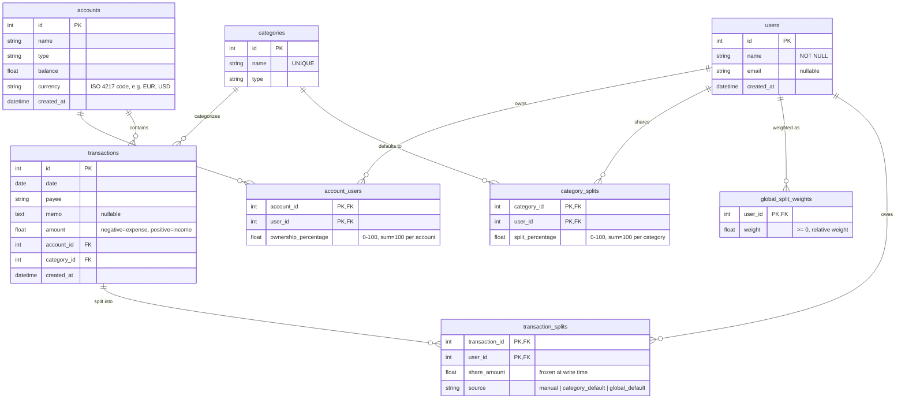

# Data Model

## Tables

### `users`
Stores application users. Each user can own one or more accounts (via `account_users`).

| Column | Type | Notes |
|--------|------|-------|
| `id` | Integer | Primary key, autoincrement |
| `name` | String(100) | Required |
| `email` | String(200) | Optional |
| `created_at` | DateTime | Default: current UTC time |

### `account_users`
Junction table linking users to accounts with ownership percentages. Enables joint accounts.

| Column | Type | Notes |
|--------|------|-------|
| `account_id` | Integer | Foreign key → `accounts.id`, part of composite PK |
| `user_id` | Integer | Foreign key → `users.id`, part of composite PK |
| `ownership_percentage` | Float | Percentage of ownership (0–100). Sum must equal 100 per account |

### `accounts`
Financial accounts (checking, savings, credit card, etc.).

| Column | Type | Notes |
|--------|------|-------|
| `id` | Integer | Primary key, autoincrement |
| `name` | String(100) | Required |
| `type` | String(50) | Required |
| `balance` | Float | Default: 0.0 |
| `currency` | String(3) | ISO 4217 code, e.g. `EUR`, `USD`. Default: `EUR` |
| `created_at` | DateTime | Default: current UTC time |

### `categories`
Transaction categories (income, expense, transfer).

| Column | Type | Notes |
|--------|------|-------|
| `id` | Integer | Primary key, autoincrement |
| `name` | String(100) | Required, unique |
| `type` | String(50) | Required |

### `transactions`
Individual financial transactions.

| Column | Type | Notes |
|--------|------|-------|
| `id` | Integer | Primary key, autoincrement |
| `date` | Date | Required |
| `payee` | String(200) | Required |
| `memo` | Text | Optional |
| `amount` | Float | Negative = expense, positive = income. Denominated in the parent account's `currency` — a transaction has no currency of its own |
| `account_id` | Integer | Foreign key → `accounts.id` |
| `category_id` | Integer | Foreign key → `categories.id` |
| `created_at` | DateTime | Default: current UTC time |

### `category_splits`
Optional default split (tier 2) for a category — e.g. "Mortgage" always splits 50/50 regardless of the global default weighting.

| Column | Type | Notes |
|--------|------|-------|
| `category_id` | Integer | Foreign key → `categories.id`, part of composite PK |
| `user_id` | Integer | Foreign key → `users.id`, part of composite PK |
| `split_percentage` | Float | Percentage of this category's amount attributed to this user. Sum must equal 100 per category |

### `global_split_weights`
The fallback (tier 3) split: a relative weight per user (e.g. proportional to income), used whenever a transaction's category has no `category_splits` override and no manual override was given.

| Column | Type | Notes |
|--------|------|-------|
| `user_id` | Integer | Primary key, foreign key → `users.id` |
| `weight` | Float | Relative weight (not a percentage) — normalized against the sum of all weights at split time |

### `transaction_splits`
The resolved split for one transaction, computed once and stored — never silently recomputed if `global_split_weights` or `category_splits` change later.

| Column | Type | Notes |
|--------|------|-------|
| `transaction_id` | Integer | Foreign key → `transactions.id`, part of composite PK |
| `user_id` | Integer | Foreign key → `users.id`, part of composite PK |
| `share_amount` | Float | What this user is liable for, frozen at the time the transaction was created/updated |
| `source` | String(20) | How this share was determined: `manual`, `category_default`, or `global_default` |

## Key Relationships

- **Users ↔ Accounts**: Many-to-many via `account_users`. Each user can own multiple accounts; each account can have multiple owners (joint account).
- **Accounts ↔ Transactions**: One-to-many. An account can have many transactions.
- **Categories ↔ Transactions**: One-to-many. A category can classify many transactions.
- **Ownership validation**: The backend enforces that ownership percentages sum to exactly 100% per account (within 0.01 tolerance).
- **User filtering**: API endpoints `/api/transactions`, `/api/dashboard`, `/api/accounts` accept an optional `?user_id=X` query parameter to filter by account ownership (where `ownership_percentage > 0`).
- **Split resolution** (`backend/split_engine.py`): for each transaction, the split is resolved in priority order — an explicit override (`manual`) > `category_splits` for its category (`category_default`) > `global_split_weights` (`global_default`). If nothing is configured at any tier, no `transaction_splits` rows are created (the feature is opt-in).
- **Splits are frozen, ownership is live**: `transaction_splits.share_amount` (what a user is *liable* for) is computed once at write time and persisted. What a user *paid* is instead derived live from the account's *current* `account_users.ownership_percentage` — so historical liability stays stable even if account ownership changes later, but the settlement report always reflects today's ownership. The household balance report (`GET /api/balances`, also embedded in `GET /api/dashboard`) is `sum(paid) − sum(share_amount)` per user — positive means the household owes them, negative means they owe the household.
- **Multi-currency accounts, no conversion**: each account has its own `currency`; transactions and splits inherit it from their account rather than storing it themselves. Amounts are never converted or summed across currencies — `compute_balances()` (`backend/split_engine.py`) partitions by `(user_id, currency)`, so `GET /api/balances` returns one net position per user *per currency*, and a household with mixed-currency accounts gets a separate settlement line for each currency instead of a single blended total.
